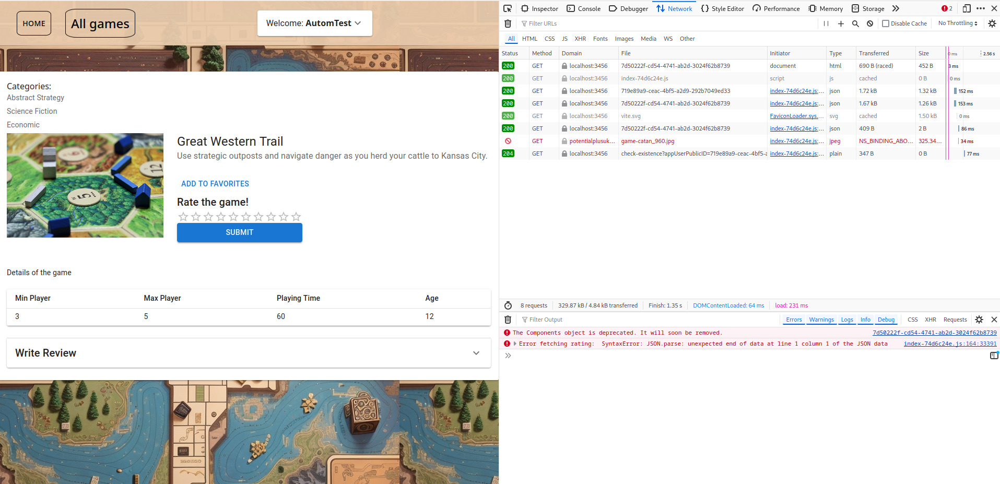
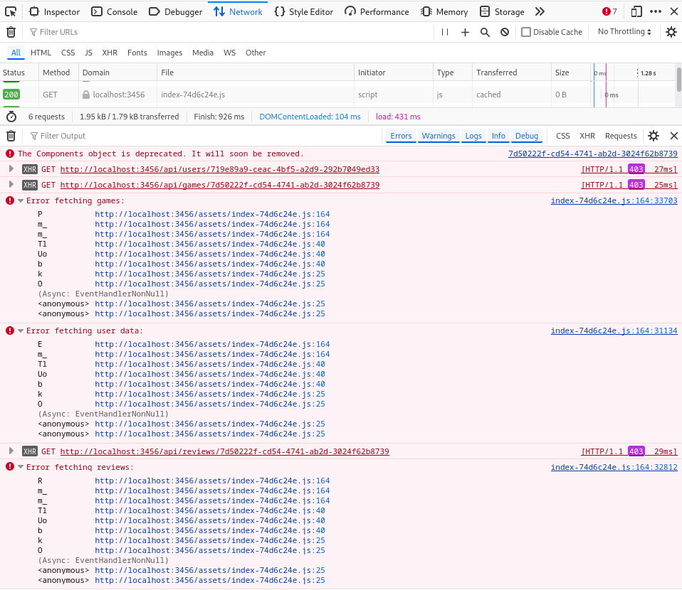

# Bug Report

## Description
Discovered the issue during automated tests when I ran the test about new review addition. In my experience, sometimes the fetch for the chosen game randomly fails. This issue causes the test to fail after 20 seconds of waiting for data on the screen. Screenshots when the bug is present and when it isn’t are both attached below.

### Steps to Reproduce
1. Register a new user.
2. Log in with the user.
3. Wait 24 hours.
4. Click on the "All games" button.
5. Choose any game.
6. "Loading..." will be seen instead of board game details.

- **Status**: Open
- **Severity**: Medium
- **Priority**: Critical

**Reported by**: @Tóth András

**Source URL**: [http://localhost:3456/games/7d50222f-cd54-4741-ab2d-3024f62b8739](http://localhost:3456/games/7d50222f-cd54-4741-ab2d-3024f62b8739)

## System Environment
- **Browser**: Mozilla Firefox 128.0 (64-bit)
- **Screen size**: 1920 x 1080
- **OS**: Fedora Linux 40 (Workstation Edition)

## Screenshots
### When the bug is present

